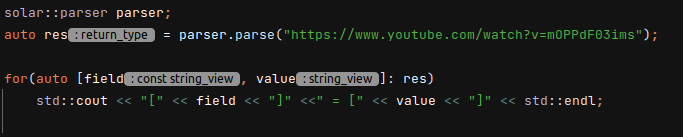
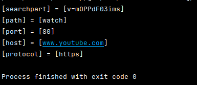

# Simple URL parser

## Deployment

### Essentials: 

* CMake version 3.14 or more (for FetchContent)
* C++ compiler supporting C++17 standard or more.

## About:
Parser allows to extract structural data from a given URL according to RFC1738 and returns a hash table containing a mapping 
from structural parts to their values. One can iterate through hashtable if one needs to extract the values. 

Parsing method itself potentially could have been implemented with regex, but I wasn't feeling like it.

URL schemes supported:
* HTTPS
* FTP
* GOPHER
* NNTP
* WAIS
* FILE
* PROSPERO
* TELNET
* MAILTO
* NEWS

Parser implemented in a form of a class and has a method called parse. This method takes a std::string_view of a given URL either in a
form of <URL:<scheme>:<scheme-specific-part>> or just <scheme>:<scheme-specific-part>.

API description:

Output: 

main.cpp as it is is in "DEBUG" mode by default and fetches tests from tests/tests.hpp you are free to just add parser.hpp to your project.

The structural parts of URLs that can be parsed might or should be further extended(like #fragment field in HTTPS URL).

Unit tests are implemented using gtest.
